# Implementation Plan: Student Verification - Exclusive Student Deals

Tasks within the same wave are independent and can run in parallel on separate
git worktrees. Tasks in wave N+1 require all wave N tasks complete before starting.

```mermaid
gantt
    title  Student Verification - Exclusive Student Deals — Delivery Sequence
    dateFormat X
    axisFormat Wave %s

    section Scaffold & Database
    Next.js project scaffold + Prisma setup   :task1, 1, 2
    Prisma schema + migration                 :crit, task2, 1, 2
    NextAuth.js session + auth pages          :crit, task3, 1, 2
    Email service abstraction (Nodemailer)    :crit, task4, 1, 2
    Scaffold observable                       :milestone, m0, 2, 0

    section OTP Verification Flow
    StudentVerification repository layer      :task5, 2, 3
    Verification service (submit/verify/resend):task6, 3, 4
    API routes: submit / verify / resend      :task7, 4, 5
    Verification flow UI pages                :task8, 4, 5
    OTP flow observable                       :milestone, m1, 5, 0

    %% Wave 4: OTP flow completes, homepage banner begins

    section Homepage Banner
    GET student_status API route              :task9, 4, 5
    Homepage banner component                 :task10, 5, 6
    Post-auth redirect continuation           :task11, 5, 6
    Banner observable                         :milestone, m2, 6, 0

    section Student Deals Page
    StudentDeal repository layer              :task12, 2, 3
    GET student_deals API route               :task13, 3, 4
    Student deals page UI                     :task14, 4, 5
    Student access guard middleware           :task15, 4, 5
    Deals page observable                     :milestone, m3, 5, 0

    section Expiry & Re-verification
    Expiry cron job                           :task16, 5, 6
    Expiry reminder email                     :task17, 5, 6
    Re-verification banner                    :task18, 6, 7
    Expiry flow observable                    :milestone, m4, 7, 0
```

---

## Wave 1 — Scaffold & Database Foundation

### TASK-001 [auto][wave:1]

Scaffold the Next.js 14 (App Router) project: initialise with `create-next-app`, configure TypeScript, install Prisma, `@prisma/client`, `next-auth`, `nodemailer`, and `bcryptjs` dependencies, and establish the base project directory structure (`app/`, `lib/`, `prisma/`).

**Satisfies:** TR-3
**Standards:** none
**Required tests:** none (scaffolding task)

---

### TASK-002 [checkpoint][wave:1]

Write the Prisma schema (`prisma/schema.prisma`) with `Member`, `StudentVerification`, and `StudentDeal` models matching `spec/storage/postgres.sql`, generate the initial migration, and confirm the local PostgreSQL dev database is reachable and migration applies cleanly — confirm database connectivity before proceeding.

**Satisfies:** BR-1, BR-2, BR-4, BR-7, TR-3
**Standards:** none
**Required tests:** none (checkpoint — confirm migration applies before wave 2 starts)

---

### TASK-003 [auto][wave:1]

Configure NextAuth.js with credentials provider (email + password), set up `app/api/auth/[...nextauth]/route.ts`, create sign-up and login pages at `app/(auth)/login/page.tsx` and `app/(auth)/signup/page.tsx`, and wire session provider in the root layout.

**Satisfies:** BR-6, TR-3
**Standards:** standards/api/rest/security.md
**Required tests:** none (scaffolding task)

---

### TASK-004 [checkpoint][wave:1]

Implement the email service abstraction: define `lib/email/EmailService.ts` interface with `sendOtp(to, code, expiresAt)` method, implement `MailtrapEmailService` backed by Nodemailer SMTP, and configure via environment variable `EMAIL_PROVIDER=mailtrap` — confirm Mailtrap SMTP credentials are available and a test send succeeds before proceeding.

**Satisfies:** TR-2, TR-3
**Standards:** none
**Required tests:** none (checkpoint — confirm Mailtrap credentials and test send before wave 2)

---

## Wave 2 — Repository Layer

### TASK-005 [tdd][wave:2]

Implement `StudentVerificationRepository` in `lib/db/studentVerificationRepository.ts`: methods for `create`, `findByMemberId`, `findByEduEmail`, `updateOtp`, `updateStatus`, `findExpiringBefore` — all backed by Prisma, satisfying the query patterns in `spec/storage/query-patterns.md`.

**Satisfies:** BR-1, BR-3, BR-4, TR-1
**Standards:** none
**Required tests:**
- Unit: `findByMemberId_returnsRecord` — returns the verification row for a given member_id
- Unit: `findByEduEmail_returnsRecord` — returns the row for a given edu_email
- Unit: `create_persistsRecord` — new StudentVerification is persisted with pending status
- Unit: `updateOtp_setsHashAndExpiry` — updates otp_code_hash and otp_expires_at
- Unit: `findExpiringBefore_returnsRows` — returns verified rows where expires_at < threshold

---

### TASK-012 [tdd][wave:2]

Implement `StudentDealRepository` in `lib/db/studentDealRepository.ts`: methods for `listActive(cursor?, limit?)` returning paginated active deals ordered by `display_order`, and `findById` — backed by Prisma.

**Satisfies:** BR-2, BR-7
**Standards:** standards/api/rest/data.md
**Required tests:**
- Unit: `listActive_returnsOnlyActiveDeals` — inactive deals are excluded
- Unit: `listActive_respectsDisplayOrder` — results are ordered by display_order ASC
- Unit: `listActive_paginatesCursorBased` — cursor-based pagination returns correct next cursor

---

## Wave 3 — Service Layer

### TASK-006 [tdd][wave:3]

Implement `VerificationService` in `lib/services/verificationService.ts` with methods: `initiateVerification(memberId, eduEmail)` (generates OTP, hashes it, sends email, creates/updates record), `verifyOtp(memberId, code)` (validates hash, attempts, expiry; sets verified+expiry on success), `resendOtp(memberId)` (rate-limit check, new OTP), `getStudentStatus(memberId)` (returns `StudentStatus` shape with `is_verified`, `status`, `expires_at`, `days_until_expiry`).

**Satisfies:** BR-1, BR-3, BR-4, TR-1, TR-2
**Standards:** none
**Required tests:**
- Unit: `initiateVerification_sendsOtpEmail` — email service sendOtp is called with correct args
- Unit: `initiateVerification_rejectsUsedEduEmail` — 422 when edu_email already verified on another account
- Unit: `verifyOtp_succeedsWithCorrectCode` — status set to verified, expires_at = verified_at + 12 months
- Unit: `verifyOtp_failsAfterThreeAttempts` — fourth attempt returns error, OTP invalidated
- Unit: `verifyOtp_failsOnExpiredOtp` — code past otp_expires_at returns error
- Unit: `resendOtp_rateLimitEnforced` — resend within 60s of otp_last_sent_at returns 429
- Unit: `getStudentStatus_returnsNoneWhenNoRecord` — status is "none" when no DB row exists
- Unit: `getStudentStatus_returnsExpiredWhenPastExpiry` — is_verified false when expires_at in past

---

### TASK-013 [tdd][wave:3]

Implement `GET /student-verification/v1/student_deals` API route at `app/api/student-verification/v1/student_deals/route.ts`: authenticate session, verify student status (403 if not verified/expired), delegate to `StudentDealRepository.listActive`, return envelope per API contract.

**Satisfies:** BR-2, BR-7, BR-8
**Standards:** standards/api/rest/contracts.md, standards/api/rest/protocol.md, standards/api/rest/security.md, standards/api/rest/data.md
**Required tests:**
- Integration: `GET_studentDeals_returns403WhenNotVerified` — unauthenticated or non-verified session returns 403
- Integration: `GET_studentDeals_returns200WithActiveDeals` — verified session returns paginated active deals in envelope
- Integration: `GET_studentDeals_excludesInactiveDeals` — inactive deals not present in response

---

## Wave 4 — API Routes & Student Deals UI

### TASK-007 [tdd][wave:4]

Implement the three verification API routes at `app/api/student-verification/v1/regions/[region_id]/members/me/`: `student_verifications/route.ts` (POST submit), `student_verifications/verify/route.ts` (POST verify), `student_verifications/resend/route.ts` (POST resend) — all delegating to `VerificationService`, returning envelopes matching the OpenAPI contract.

**Satisfies:** BR-1, BR-4, TR-1
**Standards:** standards/api/rest/contracts.md, standards/api/rest/protocol.md, standards/api/rest/security.md, standards/api/rest/data.md
**Required tests:**
- Integration: `POST_submit_returns201WithLocation` — valid .edu email creates record, returns 201 + Location header
- Integration: `POST_submit_returns422ForDuplicateEduEmail` — already-used .edu returns 422
- Integration: `POST_submit_returns400ForNonEduEmail` — non-.edu address returns 400
- Integration: `POST_verify_returns200OnSuccess` — correct code returns 200 with verified status
- Integration: `POST_verify_returns422AfterMaxAttempts` — fourth bad code returns 422
- Integration: `POST_resend_returns429WhenRateLimited` — resend within 60s returns 429 with Retry-After

---

### TASK-009 [tdd][wave:4]

Implement `GET /student-verification/v1/regions/[region_id]/members/me/student_status` at `app/api/student-verification/v1/regions/[region_id]/members/me/student_status/route.ts` — authenticate session, return `StudentStatus` envelope; unauthenticated session returns 401.

**Satisfies:** BR-5, BR-8
**Standards:** standards/api/rest/contracts.md, standards/api/rest/protocol.md, standards/api/rest/security.md
**Required tests:**
- Integration: `GET_studentStatus_returns401WhenUnauthenticated` — no session returns 401
- Integration: `GET_studentStatus_returnsNoneForNewMember` — member with no record returns status=none, is_verified=false
- Integration: `GET_studentStatus_returnsVerifiedForActiveMember` — verified member returns is_verified=true

---

### TASK-014 [auto][wave:4]

Build the Student Exclusive deals page at `app/student-deals/page.tsx`: server component fetches active deals via `StudentDealRepository`, renders merchant cards with cashback rate (converting value/scale tuple to display string), enforces server-side access guard (redirect to verification flow if not verified).

**Satisfies:** BR-2, BR-7, BR-8
**Standards:** none
**Required tests:** none (UI page — visual and access guard covered by integration tests in TASK-013 and TASK-015)

---

### TASK-015 [tdd][wave:4]

Implement the student access guard as Next.js middleware (`middleware.ts`) that checks `StudentStatus.is_verified` from the session/API on requests to `/student-deals/*` and redirects unverified users to the verification flow.

**Satisfies:** BR-2, BR-8
**Standards:** standards/api/rest/security.md
**Required tests:**
- Unit: `middleware_redirectsUnverifiedToVerificationFlow` — request to /student-deals without valid student status is redirected
- Unit: `middleware_allowsVerifiedMember` — verified session passes through to the deals page

---

## Wave 5 — Homepage Banner, Verification UI & Expiry Job

### TASK-008 [auto][wave:5]

Build the verification flow UI pages: `app/verify-student/page.tsx` (email entry form), `app/verify-student/confirm/page.tsx` (OTP entry form), `app/verify-student/success/page.tsx` (success state) — all calling the verification API routes via client-side fetch.

**Satisfies:** BR-1, BR-6
**Standards:** none
**Required tests:** none (UI scaffolding — behavior covered by API integration tests)

---

### TASK-010 [auto][wave:5]

Build the homepage student verification banner component (`components/StudentVerificationBanner.tsx`): server component that calls `GET /student_status`, renders one of three states — anonymous CTA, logged-in non-verified CTA, or verified confirmation badge (BR-5). Integrate into the homepage layout.

**Satisfies:** BR-5
**Standards:** none
**Required tests:** none (UI component — state logic covered by TASK-009 integration tests)

---

### TASK-011 [tdd][wave:5]

Implement post-auth redirect continuation: store the `callbackUrl=verify-student` query param in the NextAuth sign-in flow so that anonymous users clicking the banner CTA are returned to the verification flow after sign-up/login completes.

**Satisfies:** BR-6
**Standards:** none
**Required tests:**
- Integration: `postAuthRedirect_returnsToVerificationFlowAfterLogin` — signing in with callbackUrl lands on /verify-student
- Integration: `postAuthRedirect_returnsToVerificationFlowAfterSignup` — completing sign-up with callbackUrl lands on /verify-student

---

### TASK-016 [auto][wave:5]

Implement the expiry cron job at `lib/jobs/expireStudentVerifications.ts`: queries `StudentVerificationRepository.findExpiringBefore(now())`, sets status to `expired` for each, and exposes a Next.js API route `app/api/jobs/expire-verifications/route.ts` callable by a cron trigger (e.g. `node-cron` or manual invocation for prototype).

**Satisfies:** BR-3, BR-8
**Standards:** none
**Required tests:** none (scheduled job — correctness covered by repository tests in TASK-005)

---

### TASK-017 [tdd][wave:5]

Implement the expiry reminder email job at `lib/jobs/sendExpiryReminders.ts`: queries `StudentVerificationRepository.findExpiringBefore(now() + 7 days)` excluding already-reminded members, sends reminder email via `EmailService`, records reminder-sent timestamp on the verification record.

**Satisfies:** BR-3
**Standards:** none
**Required tests:**
- Unit: `sendExpiryReminders_sendsEmailForExpiringVerifications` — email service called for each record expiring within 7 days
- Unit: `sendExpiryReminders_skipsAlreadyRemindedMembers` — members already sent a reminder are not emailed again

---

## Wave 6 — Re-verification Banner

### TASK-018 [auto][wave:6]

Add the re-verification in-app banner to the homepage banner component: when `StudentStatus.days_until_expiry` is between 0 and 7 (or negative / expired), render a re-verification prompt CTA instead of the verified badge; link to the verification flow with the existing .edu email pre-filled.

**Satisfies:** BR-3, BR-8
**Standards:** none
**Required tests:** none (UI — state logic driven by TASK-009 student_status response)

---
