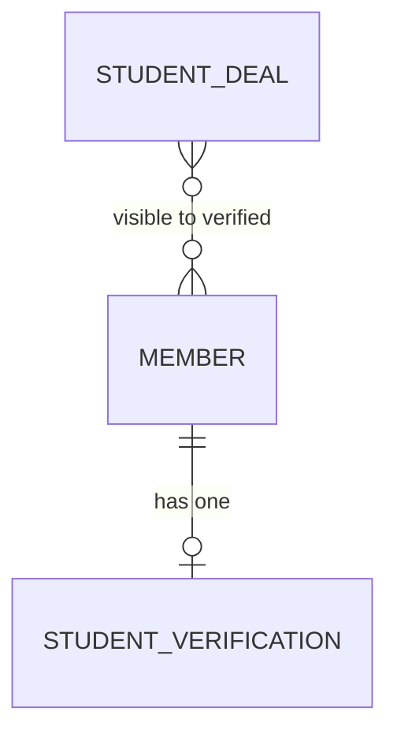

# Logical Schema

*Effort: student-verification-exclusive-student-deals*  *Authored: 2026-06-01*

---

## Entity-Relationship Diagram

## Entities

| Entity | Description |
|--------|-------------|
| MEMBER | A registered Rakuten Rewards user. Pre-existing entity; extended by student verification. |
| STUDENT_VERIFICATION | The .edu verification record for a member — holds OTP state, verification status, expiry, and attempt count. At most one record per member. |
| STUDENT_DEAL | A curated merchant deal shown on the Student Exclusive page. Access is gated by the member's verification status, not a join table. |

## Relationships

| From | Relationship | To | Notes |
|------|--------------|----|-------|
| MEMBER | has zero or one | STUDENT_VERIFICATION | A member without a verification record has never attempted verification |
| STUDENT_DEAL | visible to verified | MEMBER | No direct FK — all active deals are visible to any member whose STUDENT_VERIFICATION is active and unexpired |
